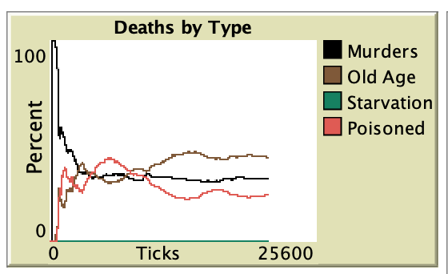

## Комп'ютерні системи імітаційного моделювання
## СПм-22-5, **Колесник Захар Володимирович**
### Лабораторна робота №**2**. Редагування імітаційних моделей у середовищі NetLogo

 

### Варіант 13, модель у середовищі NetLogo:
[Fruit Wars](http://www.netlogoweb.org/launch#http://www.netlogoweb.org/assets/modelslib/Sample%20Models/Social%20Science/Economics/Fruit%20Wars.nlogo). При генерації куща, з деякою ймовірністю (вказаною користувачем) він може стати отруйним. Після завершення збору ресурсів з куща, якщо кущ був отруйний, здобувач або помирає, або виживає (ймовірність виживання залежить від сили здобувача). Якщо здобувач їжі вижив після отруєння, він отримує зниження параметра швидкості на певну кількість тактів (вказану у внутрішніх параметрах). Отруйні кущі мають інший колір ягід на мапі. На графіку "Deaths By Type" додається новий тип смертності "від отруєння".

### Внесені зміни у вихідну логіку моделі, за варіантом:

---
**Додан показник смертності за отруєнням:** До графіку "Deaths by Type" дондан нови показник "Poisoned".

---
**Додан показник швидкості здобувача:** Додан тоглер який показує швидкість здобувача `show-speed?`.

---
**Додана отруйність кущів:** додан слайдер який регулює верогідність отруйності куща у видсотках `bush-poisoned-chance`.

---
**Імунітет до отрути:** 
додан слайдер який регулює мінімальний показник сили необхідний для виживання після отруєння `strength-value-resistent-to-poison`.

---
**Тривалість отруєння:** 
додан слайдер який регулює килькість тактів за яких здобувач отруєнний `ticks-number-poisoning-slow`.

---
**Коефіцент швидкості на час отруєння:** 
додан слайдер який регулює коефіцент швидкості на час який здобувач отруєнний `poisoned-speed-index`.

---
**Зміни у створенні куща:**
в залежності від значення у `bush-poisoned-chance` вираховується змінна `bushPoisoned`, яка показує чи кущ отруєнний і робить його ягіди чорними

до змін:
<pre>
  [
    sprout-fruit-bushes 1
    [
      set shape "Bush"
      set color one-of [ red blue orange yellow ]
      set amount 500 + random 501
      set size 3
    ]
  ]
</pre>

після змін:
<pre>
  [
    let bushPoisoned random 100 < bush-poisoned-chance
    sprout-fruit-bushes 1
    [
      set shape "Bush"
      set color ifelse-value (bushPoisoned) [black] [one-of [ red blue orange yellow ]]
      set amount 500 + random 501
      set size 3
      set poisoned bushPoisoned
    ]
  ]
</pre>

---
**Зміни у зборі куща:** 
додан блок коlу у кінці функціі збору куща `forage`, якщо кущ отруєний виконується логіка по отруєнню збірника.

якщо сила збірника нижча за `strength-value-resistent-to-poison`:
1. здобувач помирає
2. інкрєментується загальний лічильник смертності від отрюєння

якщо сила збірника вища або дорівнює за `strength-value-resistent-to-poison`:
1. виживає та отримує інтоксікацію на деяку кількість тактів (`poisoned-slownless-tick-count`)
2. втрачає щвидкість
3. втрачає енергію
4. міняє колір на чевоний
<pre>
  if bushPoisoned
  [
    if-else strength < strength-value-resistent-to-poison
    [
      set poisoned-death-count poisoned-death-count + 1
      die
    ]
    [
      if poisoned-slownless-tick-count <= 0
      [
        set poisoned-slownless-tick-count ticks-number-poisoning-slow
        set speed speed * poisoned-speed-index
        set energy energy - 50
        set color red
      ]
    ]
  ]
</pre>

---
**Зміни у руху збірників:**

#### 1. змінена логіка лейблів збірника
1. додан префікс `nrg-` до показника енергіі
2. додан показник швидкості з префіксом `spd-`

до змін:
<pre>
  if-else show-energy?
      [ set label precision energy 0 ]
      [ set label " " ]
</pre>

після змін:
<pre>
  if-else show-energy?
      [ set label word "nrg-" (precision energy 0)  ]
      [ set label " " ]
    
  if show-speed?
     [ 
       if label != " " [ set label word label " ;" ]
        set label word label word "spd-" (precision speed 0) 
     ]
</pre>

#### 2. виведення токсинів після отруюння
1. якщо це останній такт отруєння колір повертається до сірого та швидкість відновлюється до нормальної
2. декремент отруєниих тактів

<pre>
    if poisoned-slownless-tick-count = 1
      [ 
        set speed get-speed 
        set color gray
      ]
    set poisoned-slownless-tick-count poisoned-slownless-tick-count - 1
</pre>

#### 3. втрата здатності до репродукціі
до умови репродукціі додана нова умова "не бути отруєним", до змін умовою було лише "мати енергію > 200"
до змін:
<pre>
  if energy > 200
</pre>
після змін
<pre>
  if energy > 200 and poisoned-slownless-tick-count <= 0
</pre>

---
**Зміни у побудові данних для графіку смертності:**
1. було додані нові змінні: `poisoned-death-count` та `poisoned-death-rate`
2. була змінена логіка обчислення показників смертності

до змін:
<pre>
  if-else (murder-count + age-death-count + starvation-count) = 0
  [
    set murder-rate 0
    set starvation-rate 0
    set age-death-rate 0
  ]
  [
    set murder-rate 100 * murder-count / (murder-count + age-death-count + starvation-count)
    set starvation-rate 100 * starvation-count / (murder-count + age-death-count + starvation-count)
    set age-death-rate 100 * age-death-count / (murder-count + age-death-count + starvation-count)
  ]
</pre>

після змін:
<pre>
  let totalDeaths murder-count + age-death-count + starvation-count + poisoned-death-count
  if-else (totalDeaths) = 0
  [
    set murder-rate 0
    set starvation-rate 0
    set age-death-rate 0
    set poisoned-death-rate 0
  ]
  [
    set murder-rate 100 * murder-count / totalDeaths
    set starvation-rate 100 * starvation-count / totalDeaths
    set age-death-rate 100 * age-death-count / totalDeaths
    set
</pre>

